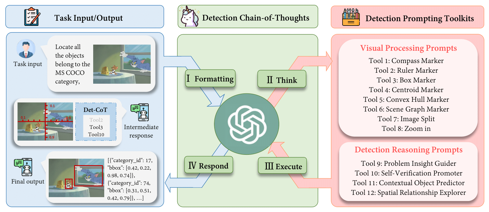
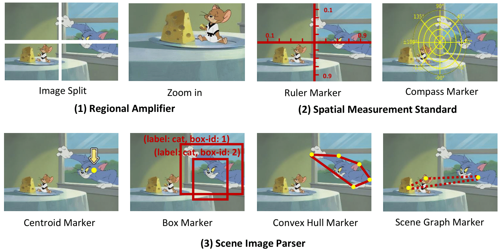

## DetToolChain: Unleashing Detection Ability of MLLMs

 **[[Paper]](https://arxiv.org/abs/2403.12488)**

- We present DetToolChain, a novel prompting paradigm, to unleash the zero-shot object detection ability of multimodal large language models (MLLMs), such as GPT-4V and Gemini. 
- Our approach consists of a detection prompting toolkit inspired by high-precision detection priors and a new Chain-of-Thought to implement these prompts.
- The detection prompting toolkit can be categorized into (1) visual processing prompts that explicitly apply visual prompts on the input image, and (2) detection reasoning prompts that help MLLMs to diagnose the detection results and reason the next prompts to be applied.

<p align="center" width="100%">
<a ></a>
</p>


## Visual Processing Prompts 
<p align="center" width="60%">
<a ></a>
</p>

## Getting Started
**1. Installation**

Git clone our repository:
```
git clone https://github.com/yixuan730/DetToolChain
cd DetToolChain
```

**2. Run Cantor Demo**

```
python main.py 
```


## Citation
```
@article{wu2024dettoolchain,
  title={Dettoolchain: A new prompting paradigm to unleash detection ability of MLLM},
  author={Wu, Yixuan and Wang, Yizhou and Tang, Shixiang and Wu, Wenhao and He, Tong and Ouyang, Wanli and Wu, Jian and Torr, Philip},
  journal={arXiv preprint arXiv:2403.12488},
  year={2024}
}
```
